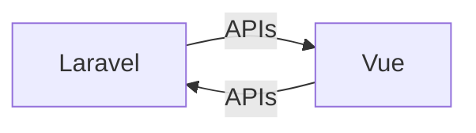

# Full stack to do list

This is a fullstack to do list application built with Laravel APIs at the backend, Vue JS at the front end with composition APIs, and Vite.

## Features

-   Create, read, update, and delete to-dos
-   Sort to-dos by priority and due date
-   Filter to-dos by status
-   Mark to-dos as complete
-   Delete to-dos

## Getting Started

## Features

-   Create, read, update, and delete to-dos
-   Sort to-dos by priority and due date
-   Filter to-dos by status
-   Mark to-dos as complete.
### Getting Started

1.  Clone this repository
2.  Install the dependencies with  `composer install`
3.  Create a database and configure the Laravel application
4.  Run the development server with  `php artisan serve`
5.  Open  `http://localhost:8000`  in your browser

## Vite

This project uses Vite to build the front end. Vite is a new build tool that is faster and more efficient than Webpack. To learn more about Vite, visit https://vitejs.dev/.